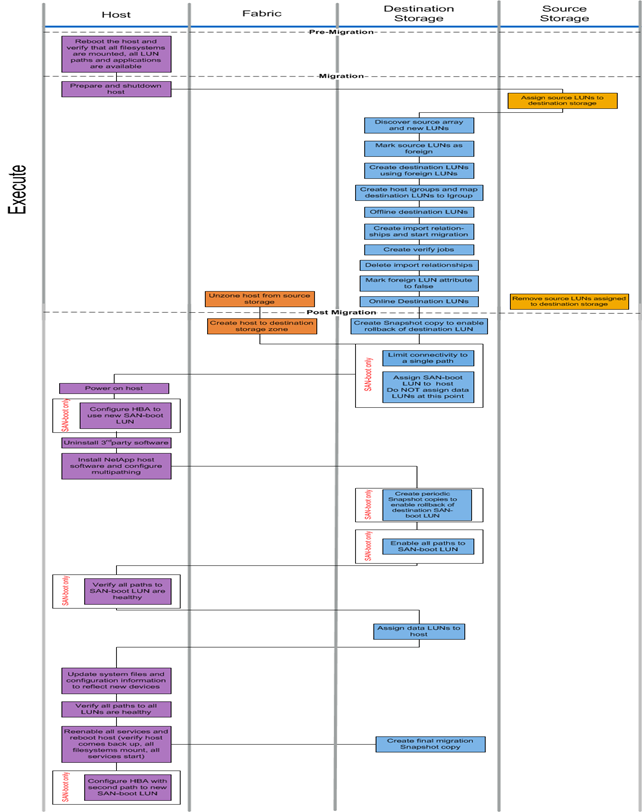

= オフライン移行ワークフロー
:allow-uri-read: 
:icons: font
:imagesdir: ../media/

[role="lead"]
オフライン移行ワークフローは、移行プロセスの実行フェーズで実行されます。次のオフラインワークフローの図は、ホスト、ファブリック、デスティネーションストレージ、ソースストレージで実行されるタスクを示しています。

オフラインワークフローのタスクを次の表に示します。

[cols="2*"]
|===
| コンポーネント | タスク 

 a| 
ホスト
 a| 
. ホストをリブートして、すべてのファイルシステムがマウントされ、すべての LUN パスが使用可能で、サービスが開始されていることを確認します。
. ホストを準備してシャットダウンします。
. 移行が完了したら、ホストの電源をオンにします。
. 新しい SAN ブート LUN を使用するように HBA を設定します（ SAN ブートのみ）。
. サードパーティ製 MPIO をアンインストールします。
. ネットアップホストソフトウェアをインストールし、マルチパスを設定します。
. SAN ブート LUN へのすべてのパスが正常であることを確認します（ SAN ブートのみ）。
. 新しいデバイスを反映するようにシステムファイルと構成を更新します。
. すべての LUN へのすべてのパスが正常であることを確認します。
. すべてのサービスを再度有効にし、ホストをリブートします（ホストが稼働状態に戻ったこと、すべてのファイルシステムがマウントされたこと、すべてのサービスが開始されたことを確認し
. 新しい SAN ブート LUN への 2 番目のパスで HBA を設定します（ SAN ブートのみ）。

 a| 
ファブリック
 a| 
. ホストとソースストレージのゾーニングを解除します。
. ホストからデスティネーションストレージへのゾーンを作成します。

 a| 
デスティネーションストレージ
 a| 
. ソースアレイと新しい LUN を検出します。
. ソース LUN を外部としてマークします。
. 外部 LUN を使用してデスティネーション LUN を作成します。
. ホストイニシエータ igroup を作成し、デスティネーション LUN を igroup にマッピングします。 migration Snapshot copy
. デスティネーション LUN をオフラインにします。
. インポート関係を作成し、インポートジョブを開始します。
. 検証ジョブを作成します（オプション）。
. インポート関係を削除します。
. 外部 LUN 属性を false にマークします。
. デスティネーション LUN をオンラインにします。
. Snapshot ® コピーを作成して、デスティネーション LUN のロールバックを有効にします。
. 接続を単一のパスに制限します（ SAN ブートのみ）。
. SAN ブート LUN をホストに割り当てます。この時点では、データ LUN の割り当ては行いません（ SAN ブートのみ）。
. すべてのホストポートにログインしていることを確認します。
. 定期的な Snapshot コピーを作成して、デスティネーション SAN ブート LUN のロールバックを有効にします（ SAN ブートのみ）。
. SAN ブート LUN へのすべてのパスを有効にします（ SAN ブートのみ）。
. データ LUN をホストに割り当てます。
. 最終的な Snapshot コピーを作成します。

 a| 
ソースストレージ
 a| 
. ソース LUN をデスティネーションストレージに割り当てます。
. デスティネーションストレージに割り当てられているソース LUN を削除します。

|===