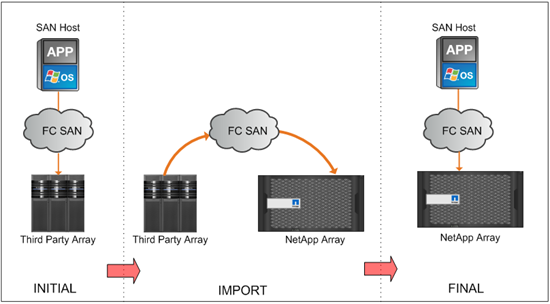

= Foreign LUN Import の概要を参照してください
:allow-uri-read: 
:icons: font
:imagesdir: ../media/

[role="lead"]
Foreign LUN Import （ FLI ）は、外部アレイ LUN からネットアップ LUN にデータを簡単かつ効率的にインポートできる ONTAP の組み込みの機能です。

FLI の移行処理はすべて LUN レベルで実行されます。FLI はあくまでブロックベースのツールです。ファイル、レコード、 NFS 、 CIFS をベースとする移行はサポートしていません。NFSやCIFS / SMBなど、ファイルレベルのプロトコル向けのその他の移行方法については、を参照してください https://library.netapp.com/ecm/ecm_get_file/ECMP12363719["データ移行ツールクイックリファレンス"]。

FLI では、 NetApp FlexArray ® テクノロジを利用して、外部 RAID アレイ LUN を検出し、そこからデータを取得します。FlexArray を使用すると、 1 つ以上のサードパーティ製アレイの手前で、 NetApp ONTAP コントローラをイニシエータとして機能させることができます。FlexArray は、これらのアレイの LUN をバックエンドストレージとしてマウントし、それらの LUN のスペースをネットアップユニファイドストレージ（ FCP 、 FCoE 、 iSCSI 、 NFS 、 CIFS / SMB プロトコルアクセスを許可）として SAN 環境または NAS 環境のホストに提供できます。

FLI には FlexArray ライセンスは必要ありません。FLI では、 FlexArray テクノロジを利用して外部 LUN を NetApp ONTAP アレイにコピーし、その LUN を使用するホストとアプリケーションを対象の LUN をホストしているネットアップアレイにポイントできます。ONTAP ではプロフェッショナルサービスによる移行は不要になりましたが、単純な移行を除くすべての移行について、範囲設定、計画、トレーニングにプロフェッショナルサービスを利用することを強く推奨します。

FLI は、 SAN LUN を ONTAP に移行するために開発されました。FLI は、次のようなさまざまな移行の要件に対応しています。

* FlexArray 構成でサポートされているように、 EMC 、日立、 HP などのベンダーからネットアップのストレージアレイまで、異機種混在ストレージアレイ間でデータを移行
* データセンターの移転や統合、アレイの交換に伴うブロックデータの移行を簡易化、迅速化
* 移行と LUN の再アライメントを 1 つのワークフローに統合。

また、 7-Mode から ONTAP への移行手順では、 32 ビットアグリゲートから 64 ビットアグリゲートへの変換、アライメントの問題の修正、 1 回の操作での LUN の移行を実行できます。

FLI を使用すると、ネットアップストレージでデータ移行用にインポートする LUN を検出できます。外部 LUN はネットアップストレージ上のディスクとして表示され、ユーザデータが誤って上書きされないように、所有権は自動的に割り当てられません。外部アレイ LUN を含むディスクは、外部としてマークする必要があります。ネットアップストレージに FLI を使用するには、外部アレイ LUN の構成に関するルールに厳密に従う必要があります。を参照してください。 xref:concept_lun_requirements_and_limitations.adoc[LUN の要件と制限事項]。

FLIでは、各コントローラに少なくとも1つの物理FCポートが必要であり、LUNをイニシエータモードで直接移行する必要があります。各ファブリックに1つずつ、合計2つのポートが推奨されますが、1つのポートでも構いません。これらのポートはソースアレイへの接続に使用され、ソースLUNを認識しマウントできるようにゾーニングとマスクを設定する必要があります。ポートをターゲットからイニシエータに変更する必要がある場合は、以下を参照してください。 link:https://docs.netapp.com/us-en/ontap/san-admin/configure-fc-adapters-task.html["FCアダプタの設定"^] 。

FLI の移行処理はオフラインまたはオンラインで実行できます。オフラインの場合はインポート中に中断を伴いますが、オンラインの場合は主に無停止で実行できます。

次の図は、 FLI オフラインデータ移行を示しています。このデータ移行では、ホストをオフラインにしています。ネットアップアレイで他社製アレイからデータを直接コピーします。

次の図は、 FLI オンラインデータ移行を示しています。新しい LUN をホストするネットアップコントローラにホストが接続されます。その後、ホスト処理を再開してインポート中も継続できます。

image::../media/foreign_lun_import_overview_2.png[FLI データ移行の概要]
