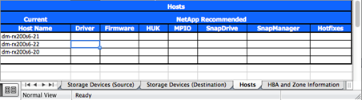

= ギャップ分析レポート
:allow-uri-read: 
:icons: font
:imagesdir: ../media/

[role="lead"]
ギャップ分析は、お客様の現在の環境とネットアップが推奨する環境に関するレポートです。移行後に実行する必要がある、お客様の環境で推奨されるすべてのアップグレードが提示されます。

ターゲット構成（移行後）には、各ホストの詳細（ OS 構成、 MPIO 、 HBA の詳細、 Host Utility Kit のバージョンなど）が含まれます。SnapDrive や SnapManager など、ネットアップのその他の必要な製品に関する情報も入手できます。

通常、必要な変更は、実際の移行イベントを開始するまでは行われません。これは、通常、メンテナンス時間のスケジュールを設定する必要があるためです。一般に、移行前に MPIO 構成に加えた変更は、現在のストレージのサポートにも影響します。

ギャップ分析レポートは、 Site Survey and Planning ワークシートの Hosts セクションにある、ネットアップが推奨する完成したセクションになります。ギャップ分析は、移行プロジェクトに含まれるすべてのホストについて実行する必要があります。完成したギャップ分析レポートは、お客様と一緒に確認する必要があります。

ギャップ分析レポートの例を次に示します。

