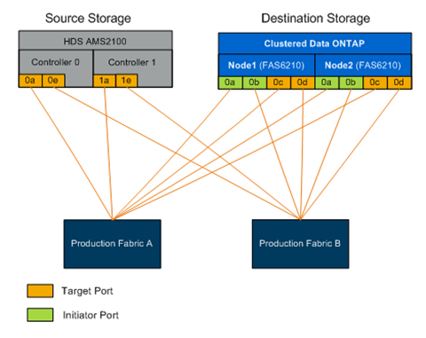

= FLI の物理的な配線の要件
:allow-uri-read: 
:icons: font
:imagesdir: ../media/

[role="lead"]
FLI の配線の要件は、 NetApp FlexArray と同じです。ネットアップストレージのイニシエータポートを、ソースストレージのターゲットポートが接続されているファブリックに接続します。ソースストレージをネットアップストレージに接続する際は、 FlexArray のベストプラクティスに従ってください。

移行で使用するストレージアレイには、両方のファブリックに各コントローラ（使用中）からのプライマリパスが必要です。つまり、移行するソースアレイとデスティネーションアレイのノードが両方のファブリックの共通のゾーンに存在している必要があります。ネットアップクラスタに他のコントローラを追加する必要はありません。必要なのは実際に LUN をインポートまたは移行するコントローラのみです。移行に間接パスを使用することもできますが、ソースアレイとデスティネーションアレイの間の最適化されたアクティブなパスを使用することを推奨します。次の図は、両方のファブリックにプライマリ（アクティブ）パスが存在する HDS AMS2100 ストレージと NetApp ONTAP ストレージを示しています。

この図は、デュアルファブリックのストレージの配線の例を示したものです。

配線に際しては、次のベストプラクティスに従ってください。

* ソースストレージとデスティネーションストレージの配線については、 NetApp FlexArray のベストプラクティスを使用してください。詳細については、 FlexArray 仮想化インストール要件およびリファレンスガイドを参照してください。
* ONTAP ストレージでは、ファブリックに接続するための空きイニシエータポートが必要です。空きポートがない場合は、イニシエータポートを設定します。

* 関連情報 *

https://docs.netapp.com/us-en/ontap-flexarray/install/index.html["FlexArray 仮想化のインストール要件およびリファレンス"]
