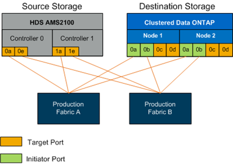

= スイッチゾーンを設定しています
:allow-uri-read: 
:icons: font
:imagesdir: ../media/

[role="lead"]
ソースストレージをデスティネーションストレージに接続するために、 SAN スイッチに必要なゾーンを作成する必要があります。

.手順
. 本番ファブリックと移行ファブリックの各スイッチ上にある既存のゾーンセットをバックアップします。
. ソースストレージとデスティネーションストレージを次のようにゾーニングします。
+

. ゾーンを作成し、本番ファブリック A のゾーンセットに追加します
+
次の例は、本番環境の本番ファブリック A のゾーン ZONE_AMS2100_cDOT_Initiator_fabA を示したものです。

+
|===
| WWPN | ゾーンメンバー 

 a| 
 50:06:0e:80:10:46:b9:60 a| 
 AMS2100 Ctrl 0 Port 0a

 a| 
 50:06:0e:80:10:46:b9:68 a| 
 AMS2100 Ctrl 1 Port 1a

 a| 
 50:0a:09:80:00:d3:51:59 a| 
 ONTAP Node 1 Port 0a

 a| 
 50:0a:09:80:00:e7:81:04 a| 
 ONTAP Node 2 Port 0a
|===
. ファブリック A でゾーンセットをアクティブにします
. ゾーンを作成し、本番ファブリック B のゾーンセットに追加します
+
次の例は、本番環境の本番ファブリック A のゾーン ZONE_AMS2100_cDOT_Initiator_fabB を示したものです。

+
|===
| WWPN | ゾーンメンバー 

 a| 
 50:06:0e:80:10:46:b9:64 a| 
 AMS2100 Ctrl 0 Port 0e

 a| 
 50:06:0e:80:10:46:b9:6c a| 
 AMS2100 Ctrl 1 Port 1e

 a| 
 50:0a:09:80:00:d3:51:59 a| 
 ONTAP Node 1 Port 0b

 a| 
 50:0a:09:80:00:e7:81:04 a| 
 ONTAP Node 2 Port 0b
|===
. 本番ファブリック B でゾーンセットをアクティブにします

