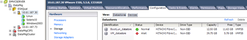
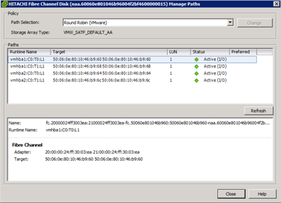

= ESXi ホストのマルチパスの検証
:allow-uri-read: 
:icons: font
:imagesdir: ../media/

[role="lead"]
Foreign LUN Import （ FLI ）プロセスの一環として、マルチパスがホストで正しく構成されて機能していることを確認する必要があります。

ESXi ホストについて、次の手順を実行します。

.手順
. VMware vSphere Client を使用して、 ESXi と仮想マシンを確認します。
+

. vSphere Client を使用して、移行する SAN LUN を特定します。
+
image::../media/esxi_host_2.png[vSphere ストレージデバイス]

. 移行する VMFS ボリュームと RDM （ vfat ）ボリュームを判別します（ esxcli storage filesystem list ）
+
[listing]
----
Mount Point                                        Volume Name        UUID                                 Mounted  Type           Size         Free
-------------------------------------------------  -----------------  -----------------------------------  -------  ------  -----------  -----------
/vmfs/volumes/538400f6-3486df59-52e5-00262d04d700  BootLun_datastore  538400f6-3486df59-52e5-00262d04d700     true  VMFS-5  13421772800  12486443008
/vmfs/volumes/53843dea-5449e4f7-88e0-00262d04d700  VM_datastore       53843dea-5449e4f7-88e0-00262d04d700     true  VMFS-5  42681237504   6208618496
/vmfs/volumes/538400f6-781de9f7-c321-00262d04d700                     538400f6-781de9f7-c321-00262d04d700     true  vfat     4293591040   4269670400
/vmfs/volumes/c49aad7f-afbab687-b54e-065116d72e55                     c49aad7f-afbab687-b54e-065116d72e55     true  vfat      261853184     77844480
/vmfs/volumes/270b9371-8fbedc2b-1f3b-47293e2ce0da                     270b9371-8fbedc2b-1f3b-47293e2ce0da     true  vfat      261853184    261844992
/vmfs/volumes/538400ef-647023fa-edef-00262d04d700                     538400ef-647023fa-edef-00262d04d700     true  vfat      299712512     99147776
~ #
----
+
[NOTE]
====
エクステントを含む VMFS （スパン VMFS ）の場合、スパンに含まれるすべての LUN を移行する必要があります。GUI のすべての拡張機能を表示するには、 [Configuration] > [Hardware] > [Storage] に移動し、 [Datastore] をクリックして [Properties] リンクを選択します。

====
+
[NOTE]
====
移行後にストレージに戻すときに、同じ VMFS ラベルを持つ LUN エントリが複数表示されます。このシナリオでは、お客様に依頼して、 head とマークされたエントリのみを選択してもらいます。

====
. 移行する LUN とサイズを決定します。 esxcfg-scsidevs-c
+
[listing]
----
Device UID                            Device Type      Console Device                                            Size      Multipath PluginDisplay Name
mpx.vmhba36:C0:T0:L0                  CD-ROM           /vmfs/devices/cdrom/mpx.vmhba36:C0:T0:L0                  0MB       NMP     Local Optiarc CD-ROM (mpx.vmhba36:C0:T0:L0)
naa.60060e801046b96004f2bf4600000014  Direct-Access    /vmfs/devices/disks/naa.60060e801046b96004f2bf4600000014  20480MB   NMP     HITACHI Fibre Channel Disk (naa.60060e801046b96004f2bf4600000014)
naa.60060e801046b96004f2bf4600000015  Direct-Access    /vmfs/devices/disks/naa.60060e801046b96004f2bf4600000015  40960MB   NMP     HITACHI Fibre Channel Disk (naa.60060e801046b96004f2bf4600000015)
~~~~~~ Output truncated ~~~~~~~
~ #
----
. 移行する Raw Device Mapping （ RDM ； raw デバイスマッピング） LUN を特定します。
. RDM デバイスの検索： '+find /vmfs/volumes-name **-RDM **+
+
[listing]
----
/vmfs/volumes/53843dea-5449e4f7-88e0-00262d04d700/Windows2003/Windows2003_1-rdmp.vmdk
/vmfs/volumes/53843dea-5449e4f7-88e0-00262d04d700/Windows2003/Windows2003_2-rdm.vmdk
/vmfs/volumes/53843dea-5449e4f7-88e0-00262d04d700/Linux/Linux_1-rdm.vmdk
/vmfs/volumes/53843dea-5449e4f7-88e0-00262d04d700/Solaris10/Solaris10_1-rdmp.vmdk
----
. 先の出力結果から -rdmp と -rdmr を削除して vmkfstools コマンドを実行し、 VML マッピングと RDM タイプを検索します。
+
[listing]
----
# vmkfstools -q /vmfs/volumes/53843dea-5449e4f7-88e0-00262d04d700/Windows2003/Windows2003_1.vmdk
vmkfstools -q /vmfs/volumes/53843dea-5449e4f7-88e0-00262d04d700/Windows2003/Windows2003_1.vmdk
Disk /vmfs/volumes/53843dea-5449e4f7-88e0-00262d04d700/Windows2003/Windows2003_1.vmdk is a Passthrough Raw Device Mapping
Maps to: vml.020002000060060e801046b96004f2bf4600000016444636303046
~ # vmkfstools -q /vmfs/volumes/53843dea-5449e4f7-88e0-00262d04d700/Windows2003/Windows2003_2.vmdk
Disk /vmfs/volumes/53843dea-5449e4f7-88e0-00262d04d700/Windows2003/Windows2003_2.vmdk is a Non-passthrough Raw Device Mapping
Maps to: vml.020003000060060e801046b96004f2bf4600000017444636303046
~ # vmkfstools -q /vmfs/volumes/53843dea-5449e4f7-88e0-00262d04d700/Linux/Linux_1.vmdk
Disk /vmfs/volumes/53843dea-5449e4f7-88e0-00262d04d700/Linux/Linux_1.vmdk is a Non-passthrough Raw Device Mapping
Maps to: vml.020005000060060e801046b96004f2bf4600000019444636303046
~ # vmkfstools -q /vmfs/volumes/53843dea-5449e4f7-88e0-00262d04d700/Solaris10/Solaris10_1.vmdk
Disk /vmfs/volumes/53843dea-5449e4f7-88e0-00262d04d700/Solaris10/Solaris10_1.vmdk is a Passthrough Raw Device Mapping
Maps to: vml.020004000060060e801046b96004f2bf4600000018444636303046
~ #
----
+
[NOTE]
====
パススルーは物理互換 RDM （ RDmp\ ）で、非パススルーは仮想互換 RDM （ RDMV\ ）です。仮想 RDM と VM Snapshot コピーを使用する VM は、 VM Snapshot の差分 VMDK が古い NAA ID の RDM をポイントしているため、移行後に切断されます。そのため、移行の前に、お客様に依頼して該当する VM の Snapshot コピーをすべて削除してもらいます。VM を右クリックし、 [ スナップショット ] 、 [Snapshot Manager ] 、 [ すべて削除 ] の順にクリックします。ネットアップストレージでの VMware のハードウェアアクセラレーションロックの詳細については、ネットアップナレッジベース 3013935 を参照してください。

====
. RDM デバイスにマッピングされている LUN NAA を特定します。
+
[listing]
----
~ # esxcfg-scsidevs -u | grep vml.020002000060060e801046b96004f2bf4600000016444636303046
naa.60060e801046b96004f2bf4600000016                            vml.020002000060060e801046b96004f2bf4600000016444636303046
~ # esxcfg-scsidevs -u | grep vml.020003000060060e801046b96004f2bf4600000017444636303046
naa.60060e801046b96004f2bf4600000017                            vml.020003000060060e801046b96004f2bf4600000017444636303046
~ # esxcfg-scsidevs -u | grep vml.020005000060060e801046b96004f2bf4600000019444636303046
naa.60060e801046b96004f2bf4600000019                            vml.020005000060060e801046b96004f2bf4600000019444636303046
~ # esxcfg-scsidevs -u | grep vml.020004000060060e801046b96004f2bf4600000018444636303046
naa.60060e801046b96004f2bf4600000018                            vml.020004000060060e801046b96004f2bf4600000018444636303046
~ #
----
. 仮想マシンの構成を確認します（ esxcli storage filesystem list | grep VMFS' ）
+
[listing]
----
/vmfs/volumes/538400f6-3486df59-52e5-00262d04d700  BootLun_datastore  538400f6-3486df59-52e5-00262d04d700     true  VMFS-5  13421772800  12486443008
/vmfs/volumes/53843dea-5449e4f7-88e0-00262d04d700  VM_datastore       53843dea-5449e4f7-88e0-00262d04d700     true  VMFS-5  42681237504   6208618496
~ #
----
. データストアの UUID を記録します。
. /etc/vmware/hostd/vmInventory.xml のコピーを作成し、ファイルと vmx 構成パスの内容をメモします。
+
[listing]
----
~ # cp /etc/vmware/hostd/vmInventory.xml /etc/vmware/hostd/vmInventory.xml.bef_mig
~ # cat /etc/vmware/hostd/vmInventory.xml
<ConfigRoot>
  <ConfigEntry id="0001">
    <objID>2</objID>
    <vmxCfgPath>/vmfs/volumes/53843dea-5449e4f7-88e0-00262d04d700/Windows2003/Windows2003.vmx</vmxCfgPath>
  </ConfigEntry>
  <ConfigEntry id="0004">
    <objID>5</objID>
    <vmxCfgPath>/vmfs/volumes/53843dea-5449e4f7-88e0-00262d04d700/Linux/Linux.vmx</vmxCfgPath>
  </ConfigEntry>
  <ConfigEntry id="0005">
    <objID>6</objID>
    <vmxCfgPath>/vmfs/volumes/53843dea-5449e4f7-88e0-00262d04d700/Solaris10/Solaris10.vmx</vmxCfgPath>
  </ConfigEntry>
</ConfigRoot>
----
. 仮想マシンのハードディスクを特定します。
+
この情報は、移行後に削除された RDM デバイスを順番に追加するために必要になります。

+
[listing]
----
~ # grep fileName /vmfs/volumes/53843dea-5449e4f7-88e0-00262d04d700/Windows2003/Windows2003.vmx
scsi0:0.fileName = "Windows2003.vmdk"
scsi0:1.fileName = "Windows2003_1.vmdk"
scsi0:2.fileName = "Windows2003_2.vmdk"
~ # grep fileName /vmfs/volumes/53843dea-5449e4f7-88e0-00262d04d700/Linux/Linux.vmx
scsi0:0.fileName = "Linux.vmdk"
scsi0:1.fileName = "Linux_1.vmdk"
~ # grep fileName /vmfs/volumes/53843dea-5449e4f7-88e0-00262d04d700/Solaris10/Solaris10.vmx
scsi0:0.fileName = "Solaris10.vmdk"
scsi0:1.fileName = "Solaris10_1.vmdk"
~ #
----
. RDM デバイス、仮想マシンマッピング、互換モードを確認します。
. 上記の情報を使用して、 RDM マッピングのデバイス、仮想マシン、互換モード、順序をメモします。
+
この情報は、 RDM デバイスを VM に追加するときに必要になります。

+
[listing]
----
Virtual Machine -> Hardware -> NAA -> Compatibility mode
Windows2003 VM -> scsi0:1.fileName = "Windows2003_1.vmdk" -> naa.60060e801046b96004f2bf4600000016
-> RDM Physical
Windows2003 VM -> scsi0:2.fileName = "Windows2003_2.vmdk" -> naa.60060e801046b96004f2bf4600000017
-> RDM Virtual
Linux VM -> scsi0:1.fileName = “Linux_1.vmdk” -> naa.60060e801046b96004f2bf4600000019 -> RDM Virtual
Solaris10 VM -> scsi0:1.fileName = “Solaris10_1.vmdk” -> naa.60060e801046b96004f2bf4600000018 -> RDM Physical
----
. マルチパス構成を確認します。
. vSphere Client でストレージのマルチパス設定を確認します。
+
.. vSphere Client で ESX または ESXi ホストを選択し、 Configuration （設定）タブをクリックします。
.. [* ストレージ * ] をクリックします。
.. データストアまたはマッピングされた LUN を選択します。
.. * プロパティ * をクリックします。
.. [ プロパティ（ Properties ） ] ダイアログボックスで、必要に応じて任意のエクステントを選択する。
.. * エクステント・デバイス * > * パスの管理 * をクリックして、パスの管理ダイアログボックスでパスを取得します。
+

. ESXi ホストのコマンドラインから LUN マルチパス情報を取得します。
+
.. ESXi ホストコンソールにログインします。
.. esxcli storage nmp device list を実行してマルチパス情報を取得します。
+
[listing]
----
# esxcli storage nmp device list
naa.60060e801046b96004f2bf4600000014
   Device Display Name: HITACHI Fibre Channel Disk (naa.60060e801046b96004f2bf4600000014)
   Storage Array Type: VMW_SATP_DEFAULT_AA
   Storage Array Type Device Config: SATP VMW_SATP_DEFAULT_AA does not support device configuration.
   Path Selection Policy: VMW_PSP_RR
   Path Selection Policy Device Config: {policy=rr,iops=1000,bytes=10485760,useANO=0; lastPathIndex=3: NumIOsPending=0,numBytesPending=0}
   Path Selection Policy Device Custom Config:
   Working Paths: vmhba2:C0:T1:L0, vmhba2:C0:T0:L0, vmhba1:C0:T1:L0, vmhba1:C0:T0:L0
   Is Local SAS Device: false
   Is Boot USB Device: false

naa.60060e801046b96004f2bf4600000015
   Device Display Name: HITACHI Fibre Channel Disk (naa.60060e801046b96004f2bf4600000015)
   Storage Array Type: VMW_SATP_DEFAULT_AA
   Storage Array Type Device Config: SATP VMW_SATP_DEFAULT_AA does not support device configuration.
   Path Selection Policy: VMW_PSP_RR
   Path Selection Policy Device Config: {policy=rr,iops=1000,bytes=10485760,useANO=0; lastPathIndex=0: NumIOsPending=0,numBytesPending=0}
   Path Selection Policy Device Custom Config:
   Working Paths: vmhba2:C0:T1:L1, vmhba2:C0:T0:L1, vmhba1:C0:T1:L1, vmhba1:C0:T0:L1
   Is Local SAS Device: false
   Is Boot USB Device: false

naa.60060e801046b96004f2bf4600000016
   Device Display Name: HITACHI Fibre Channel Disk (naa.60060e801046b96004f2bf4600000016)
   Storage Array Type: VMW_SATP_DEFAULT_AA
   Storage Array Type Device Config: SATP VMW_SATP_DEFAULT_AA does not support device configuration.
   Path Selection Policy: VMW_PSP_RR
   Path Selection Policy Device Config: {policy=rr,iops=1000,bytes=10485760,useANO=0; lastPathIndex=1: NumIOsPending=0,numBytesPending=0}
   Path Selection Policy Device Custom Config:
   Working Paths: vmhba2:C0:T1:L2, vmhba2:C0:T0:L2, vmhba1:C0:T1:L2, vmhba1:C0:T0:L2
   Is Local SAS Device: false
   Is Boot USB Device: false

naa.60060e801046b96004f2bf4600000017
   Device Display Name: HITACHI Fibre Channel Disk (naa.60060e801046b96004f2bf4600000017)
   Storage Array Type: VMW_SATP_DEFAULT_AA
   Storage Array Type Device Config: SATP VMW_SATP_DEFAULT_AA does not support device configuration.
   Path Selection Policy: VMW_PSP_RR
   Path Selection Policy Device Config: {policy=rr,iops=1000,bytes=10485760,useANO=0; lastPathIndex=1: NumIOsPending=0,numBytesPending=0}
   Path Selection Policy Device Custom Config:
   Working Paths: vmhba2:C0:T1:L3, vmhba2:C0:T0:L3, vmhba1:C0:T1:L3, vmhba1:C0:T0:L3
   Is Local SAS Device: false
   Is Boot USB Device: false

naa.60060e801046b96004f2bf4600000018
   Device Display Name: HITACHI Fibre Channel Disk (naa.60060e801046b96004f2bf4600000018)
   Storage Array Type: VMW_SATP_DEFAULT_AA
   Storage Array Type Device Config: SATP VMW_SATP_DEFAULT_AA does not support device configuration.
   Path Selection Policy: VMW_PSP_RR
   Path Selection Policy Device Config: {policy=rr,iops=1000,bytes=10485760,useANO=0; lastPathIndex=1: NumIOsPending=0,numBytesPending=0}
   Path Selection Policy Device Custom Config:
   Working Paths: vmhba2:C0:T1:L4, vmhba2:C0:T0:L4, vmhba1:C0:T1:L4, vmhba1:C0:T0:L4
   Is Local SAS Device: false
   Is Boot USB Device: false

naa.60060e801046b96004f2bf4600000019
   Device Display Name: HITACHI Fibre Channel Disk (naa.60060e801046b96004f2bf4600000019)
   Storage Array Type: VMW_SATP_DEFAULT_AA
   Storage Array Type Device Config: SATP VMW_SATP_DEFAULT_AA does not support device configuration.
   Path Selection Policy: VMW_PSP_RR
   Path Selection Policy Device Config: {policy=rr,iops=1000,bytes=10485760,useANO=0; lastPathIndex=1: NumIOsPending=0,numBytesPending=0}
   Path Selection Policy Device Custom Config:
   Working Paths: vmhba2:C0:T1:L5, vmhba2:C0:T0:L5, vmhba1:C0:T1:L5, vmhba1:C0:T0:L5
   Is Local SAS Device: false
   Is Boot USB Device: false
----

