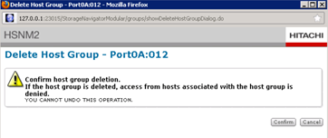

= デスティネーションアレイ構成を削除しています
:allow-uri-read: 
:icons: font
:imagesdir: ../media/

[role="lead"]
FLI 移行の完了後にソースアレイからデスティネーションアレイの構成を削除する手順を次に示します。

.手順
. Hitachi Storage Navigator Modular にシステムとしてログインします。
. [* AMS 2100 * array] を選択し、 [* Show * and * Configure Array] をクリックします。
. root を使用してログインします。
. Groups を展開し、 * Host Groups * を選択します。
. cDOT * FLI * ホストグループを選択し、 * ホストグループの削除 * をクリックします。
+
image::../media/remove_destination_array_configuration_from_source_array_1.png[ソースアレイから宛先アレイの構成を削除する]

. ホストグループを削除することを確認します。
+

